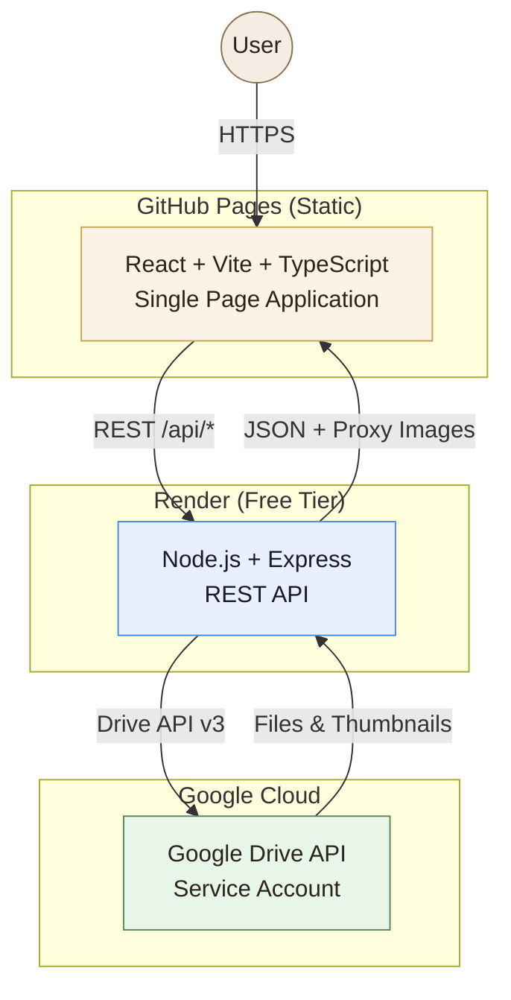
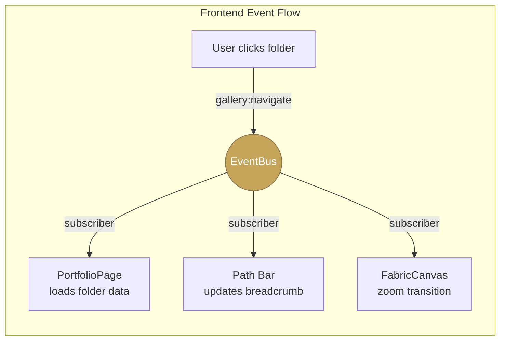

# ArtGallery — Portfolio di Debora Vacchino

Interactive portfolio for **Debora Vacchino**, decorative facade painter and mural restorer with 30 years of artisan craftsmanship in Liguria, Italy.

**Live site:** https://favagit.github.io/ArtGallery-/

---

## Architecture



### How It Works

1. **Frontend** — A React SPA served as static files from GitHub Pages. It provides two gallery views (Grid and Canvas) with an event-driven architecture. All UI components communicate through a typed **EventBus** singleton, keeping modules loosely coupled.

2. **Backend** — An Express API deployed on Render. It authenticates requests via JWT, interfaces with Google Drive through a service account, and proxies thumbnail images to avoid CORS restrictions. All Drive content (folders, images) is managed through REST endpoints.

3. **Google Drive** — Acts as the content management system. Debora's portfolio images and project folders are stored in a shared Drive folder. The backend reads metadata and generates thumbnail URLs; the frontend displays them in an interactive gallery.

4. **Event-Driven Flow** — User interactions (navigate folder, view image, search) emit typed events on the EventBus. Subscriber components react independently — the gallery reloads data, the path bar updates, the canvas animates a zoom transition — all without tight coupling.



---

## Current Implementation Status

### Frontend

| Feature | Status |
|---------|--------|
| React + Vite + TypeScript SPA | ✅ |
| Warm Italian atelier design (Playfair Display + Inter, gold/terracotta/sage palette) | ✅ |
| Grid view with hover icon overlays (eye/folder SVG icons) | ✅ |
| Fabric.js interactive Canvas view (zoom, pan, hover icons) | ✅ |
| Image lightbox modal (same-page full-res view, Escape to close) | ✅ |
| Folder content previews (2×2 thumbnail grid on folder cards) | ✅ |
| Path bar navigation (Home icon, chevron breadcrumbs, back button) | ✅ |
| Cinematic zoom transition on folder navigation (Canvas view) | ✅ |
| Expandable search from toolbar icon | ✅ |
| Event-Driven Architecture with typed EventBus | ✅ |
| JWT authentication with admin/viewer roles | ✅ |
| i18n support (English / Italian) | ✅ |
| Runtime configuration panel (brand, API URL, folder, visibility) | ✅ |
| Toast notification system | ✅ |
| Responsive design (mobile-friendly) | ✅ |

### Backend

| Feature | Status |
|---------|--------|
| Express REST API with TypeScript | ✅ |
| Google Drive API integration via service account | ✅ |
| Thumbnail proxy endpoint (bypasses CORS/Tracking Prevention) | ✅ |
| JWT auth with role-based access control | ✅ |
| CRUD operations on Drive items (create, rename, move, copy, delete) | ✅ |
| CORS configuration for GitHub Pages origin | ✅ |

### CI/CD & Hosting

| Feature | Status |
|---------|--------|
| CI workflow (lint + build on push/PR) | ✅ |
| GitHub Pages auto-deploy on push to main | ✅ |
| Render Blueprint (`render.yaml`) for backend | ✅ |
| `VITE_API_BASE_URL` injected at build time | ✅ |

---

## Project Structure

```
ArtGallery/
├── frontend/
│   └── src/
│       ├── api/           # REST client + Drive API calls
│       ├── components/    # GalleryGrid, FabricCanvas, Lightbox, TopNav, Toaster
│       ├── config/        # Runtime app configuration
│       ├── events/        # EventBus singleton + typed event map + useEvent hook
│       ├── i18n/          # EN/IT message bundles
│       ├── pages/         # PortfolioPage, AdminPage
│       ├── types/         # Shared TypeScript interfaces
│       ├── App.tsx        # Root shell with routing, auth, footer
│       ├── App.css        # Component styles (atelier theme)
│       └── index.css      # Design tokens (palette, typography, spacing)
├── backend/
│   └── src/
│       ├── middleware/     # JWT auth, role guard
│       ├── routes/        # Auth routes, Drive routes
│       ├── services/      # Google Drive service
│       ├── types/         # Backend TypeScript types
│       └── index.ts       # Express server entry point
├── .github/
│   └── workflows/
│       ├── ci.yml              # Lint + build on push/PR
│       └── deploy-pages.yml    # GitHub Pages deployment
├── render.yaml            # Render Blueprint for backend
└── package.json           # Root workspace scripts
```

---

## Scripts

From project root:

| Command | Description |
|---------|-------------|
| `npm run dev` | Start frontend + backend concurrently (dev mode) |
| `npm run build` | Build frontend (Vite) + backend (tsc) |
| `npm run start` | Start backend production build |
| `npm run lint` | ESLint frontend |

Default URLs in dev: Frontend http://localhost:5173 · Backend http://localhost:4000/api/health

---

## Deployment

### Frontend → GitHub Pages

Automated via `.github/workflows/deploy-pages.yml` on push to `main`.

Published at: https://favagit.github.io/ArtGallery-/

### Backend → Render

A `render.yaml` Blueprint is included. Setup:

1. Go to https://dashboard.render.com → **New** → **Blueprint** → select repo.
2. Set environment variables in Render dashboard:
   - `AUTH_USERS_JSON` — e.g. `[{"username":"admin","password":"strongpwd","role":"admin"}]`
   - `GOOGLE_DRIVE_ROOT_FOLDER_ID` — Drive folder shared with service account
   - `GOOGLE_SERVICE_ACCOUNT_JSON` — full service account JSON key
3. Deploy triggers automatically. Health check: `GET /api/health`.

> **Note:** Render free-tier services spin down after 15 min of inactivity.
> The first request after idle may take ~30 s while the service restarts.

---

## API Reference

### Authentication

| Method | Endpoint | Description |
|--------|----------|-------------|
| POST | `/api/auth/login` | Login with username/password → JWT token |
| GET | `/api/auth/me` | Get current user (requires Bearer token) |

### Drive (Public)

| Method | Endpoint | Description |
|--------|----------|-------------|
| GET | `/api/drive/status` | Validate Drive credentials |
| GET | `/api/drive/folders?parentId=` | List child folders |
| GET | `/api/drive/items?folderId=&pageSize=&search=` | List files/folders |
| GET | `/api/drive/thumbnail/:fileId?size=` | Proxy thumbnail (32–1600px, 24h cache) |

### Drive (Admin only — requires JWT)

| Method | Endpoint | Description |
|--------|----------|-------------|
| POST | `/api/drive/folders` | Create folder |
| PATCH | `/api/drive/items/:id/rename` | Rename item |
| PATCH | `/api/drive/items/:id/move` | Move item |
| POST | `/api/drive/items/copy` | Copy item |
| DELETE | `/api/drive/items/:id` | Delete item |

---

## Design

The visual identity is inspired by Italian Renaissance frescoes and Ligurian architecture:

- **Fonts:** Playfair Display (display), Inter (body)
- **Palette:** Parchment `#faf7f2`, Gold `#c5a55a`, Terracotta `#c47d5a`, Sage `#8a9e7a`
- **Interactions:** Glassmorphic hover overlays, cinematic folder zoom transitions, animated lightbox
